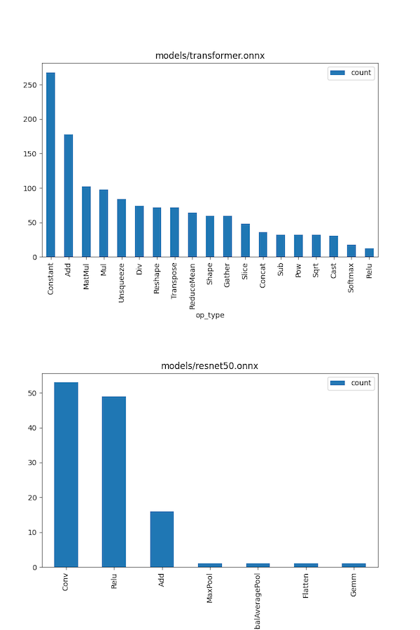
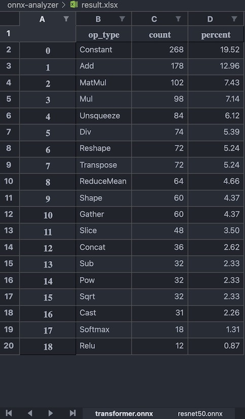

# onnx-analyzer
Tools for analyzing onnx models

### Prerequisites

- [direnv](https://direnv.net/), can be skipped by running commands in [.envrc](.envrc) manually.

- [pyenv](https://github.com/pyenv/pyenv), with `pyenv install 3.9.9`, can be other python3 versions, controlled by `PYENV_VERSION`

- After python envrionment is properly set: `pip install -r requirements.txt`

- Optional: [GitLFS](https://docs.github.com/en/repositories/working-with-files/managing-large-files/installing-git-large-file-storage)

### Usage
```
$ python analyze.py -h
usage: analyze.py [-h] [-p PATH] [-m MODEL] [-macs] [-vis VIS] [-excel EXCEL] [--loglevel LOGLEVEL]

ONNX analyzer

optional arguments:
  -h, --help            show this help message and exit
  -p PATH, --path PATH  Parent path to ONNX models.
  -m MODEL, --model MODEL
                        Path to an ONNX model.
  -macs, --calculate-macs
                        Calculate MACs.
  -vis VIS              Save visualizations plot to.
  -excel EXCEL          Export results in excel format to.
  --loglevel LOGLEVEL   Provide logging level. Example --loglevel debug
```

Assuming your onnx models have been placed under `models/` folder:
```
python analyze.py -p models/ -vis result.png -excel result.xlsx
```
Above command will print statistics for all models under that folder to console and save both visualization plots and data in excel format to current directory.

**NOTE:** the existing models under `models/` folder are uploaded via [GitLFS](https://docs.github.com/en/repositories/working-with-files/managing-large-files/installing-git-large-file-storage).

#### Outputs:




### TODO

- Analyze MAC calculations for frequently used operations
- Analyze element wise operations